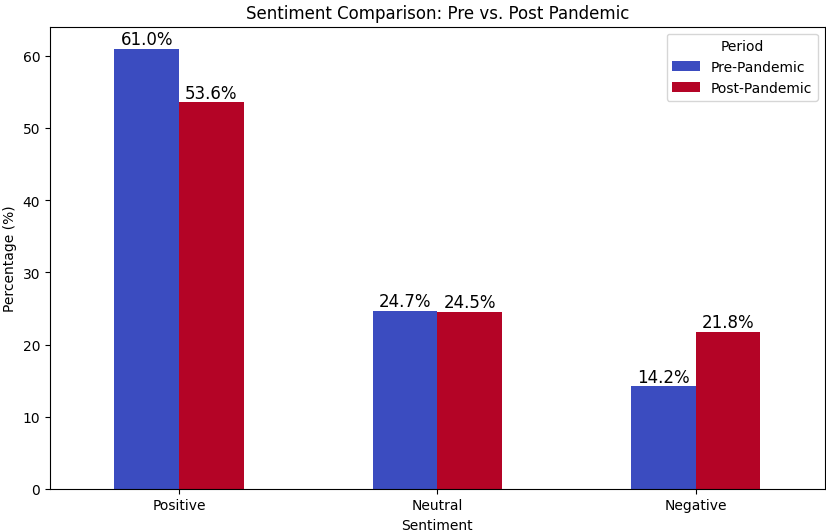
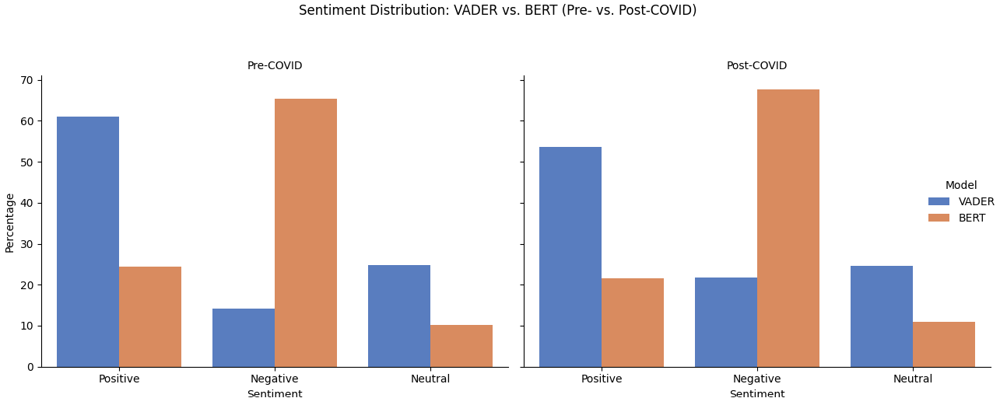

# 📊 Sentiment Analysis of Remote Work Discussions on Reddit

A research project exploring how public sentiment toward remote work evolved before and after COVID-19, using NLP models like VADER, BERT, and emotion detection via the NRC lexicon.

## 🚀 Overview
This study analyzes 2,500+ Reddit posts to understand how people perceived remote work during different phases of the pandemic.

## 🔧 Technologies Used
- Python (pandas, matplotlib, seaborn, transformers)
- HuggingFace Transformers
- VADER Sentiment Analyzer
- NRC Emotion Lexicon
- Quarto for PDF reports

## 📊 Sample Visual

### VADER Sentiment Distribution Before vs After COVID-19



## 📈 Results Summary

- Emotion analysis using the **NRC Lexicon** showed a rise in both positive and negative emotions post-pandemic.
- **VADER sentiment** shifted from 61% positive (pre-pandemic) to 53% positive (post-pandemic).
- **BERT sentiment** showed even stronger negative trends, with over 67% posts labeled negative post-pandemic.
- Monthly sentiment trends indicated a gradual rise in dissatisfaction over time.
- Remote work was initially seen as a benefit, but long-term effects such as isolation and burnout became prominent.

## 🛠️ Setup Instructions

```bash
git clone https://github.com/your-username/CSS-Project.git
cd CSS-Project
pip install -r requirements.txt

